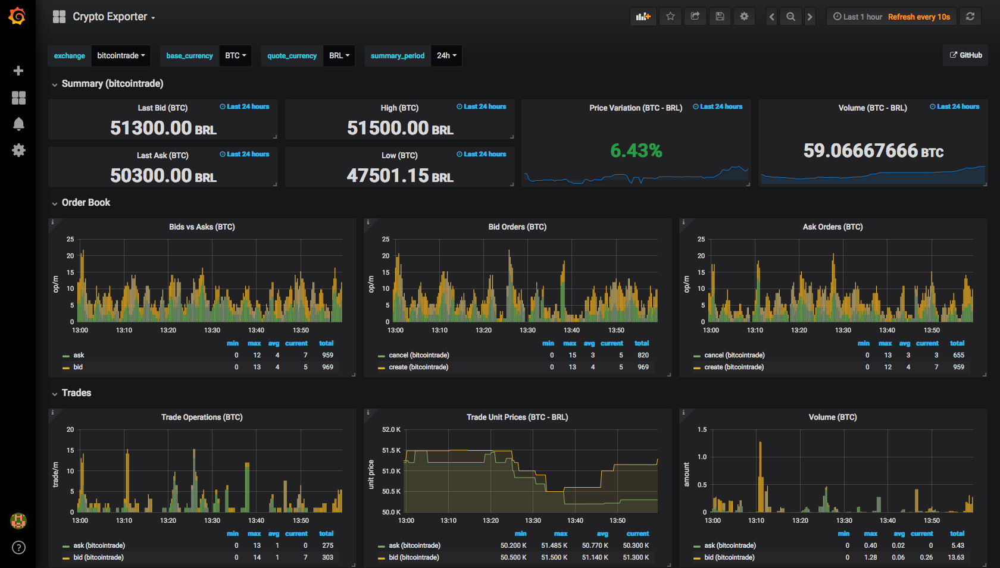

# Crypto Exporter

Prometheus exporter for exposing trading information from multiple (soon!)
cryptocurrency exchanges in a consistent way, making it easy to compare prices,
volume, and trading behavior, between exchanges.

## Collectors

**Note:** This is still in early stages of development; more exchanges to be
added soon.

These are the exchanges currently supported by this collector:

- [Bitcointrade](https://bitcointrade.com.br)

If you want to contribute support for your exchange of choice, feel free to do
so!

## Metrics

This are the metrics currently exposed by this server:

| Metric Name             | Type    | Description                                 | 
|-------------------------|---------|---------------------------------------------|
| `<ns>_order_count`      | Counter | Number of unexecuted/canceled orders.       |
| `<ns>_trade_count`      | Counter | Number of executed orders.                  |
| `<ns>_trade_price`      | Gauge   | Last trade amount, in quote currency.       |
| `<ns>_trade_amount`     | Gauge   | Last trade amount, in base currency.        |
| `<ns>_trade_amount_sum` | Counter | Sum of all trade amounts, in base currency. |

Where `<ns>` is the value provided via the `-namespace` [command line flag](#flags).

### Grafana Dashboard

Check the `./sample/` directory to see how to collect metrics from this
exporter and display those metrics in Grafana via the provided dashboard.



**Note:** This screenshot is for demonstration purposes only.

## Building And Running

Prerequisites:

- [Go compiler](https://golang.org/dl/)
- [Godep](https://github.com/tools/godep)

Building:

```
$ git clone https://github.com/danielfm/crypto-exporter.git
$ cd crypto-exporter
$ godep restore
$ make GO=go
$ ./bin/crypto-exporter <flags>
```

## Flags

```
$ ./bin/crypto-exporter -h
Usage of ./bin/crypto-exporter:
  -alsologtostderr
        log to standard error as well as files
  -endpoint string
        Path under which to expose metrics. (default "/metrics")
  -listen-address string
        The address to listen on for HTTP requests. (default ":8080")
  -log_backtrace_at value
        when logging hits line file:N, emit a stack trace
  -log_dir string
        If non-empty, write log files in this directory
  -logtostderr
        log to standard error instead of files
  -namespace string
        Metrics namespace. (default "crypto")
  -stderrthreshold value
        logs at or above this threshold go to stderr
  -v value
        log level for V logs
  -vmodule value
        comma-separated list of pattern=N settings for file-filtered logging
```

## Donate

If this project is useful for you, buy me a beer!

Bitcoin: `bc1qtwyfcj7pssk0krn5wyfaca47caar6nk9yyc4mu`

## License

Copyright (C) Daniel Fernandes Martins

Distributed under the New BSD License. See LICENSE for further details.
